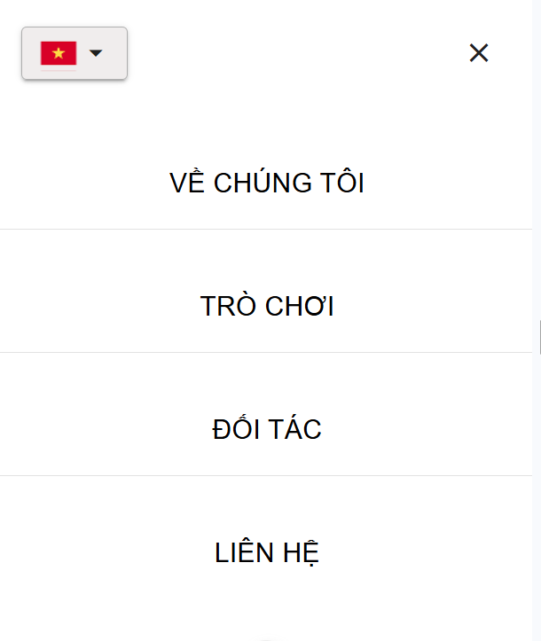

# vue

This template should help get you started developing with Vue 3 in Vite.

## 🔗 Demo Website

👉 https://pham28122013.github.io/LandingPage

## 🖼️ Screenshot

### 💻 Desktop View

**Vietnamese**


**English**


### 📱 Mobile View

**Vietnamese**


**English**


### 📋 Mobile Menu

**Vietnamese**


**English**


## Recommended IDE Setup

[VSCode](https://code.visualstudio.com/) + [Volar](https://marketplace.visualstudio.com/items?itemName=Vue.volar) (and disable Vetur).

## Customize configuration

See [Vite Configuration Reference](https://vite.dev/config/).

## Project Setup

```sh
npm install